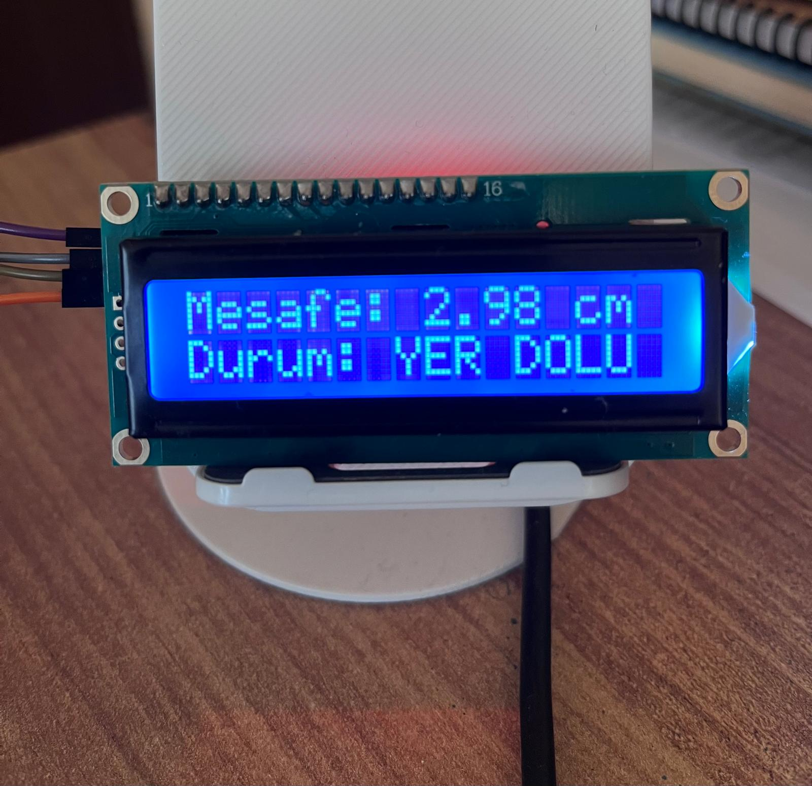
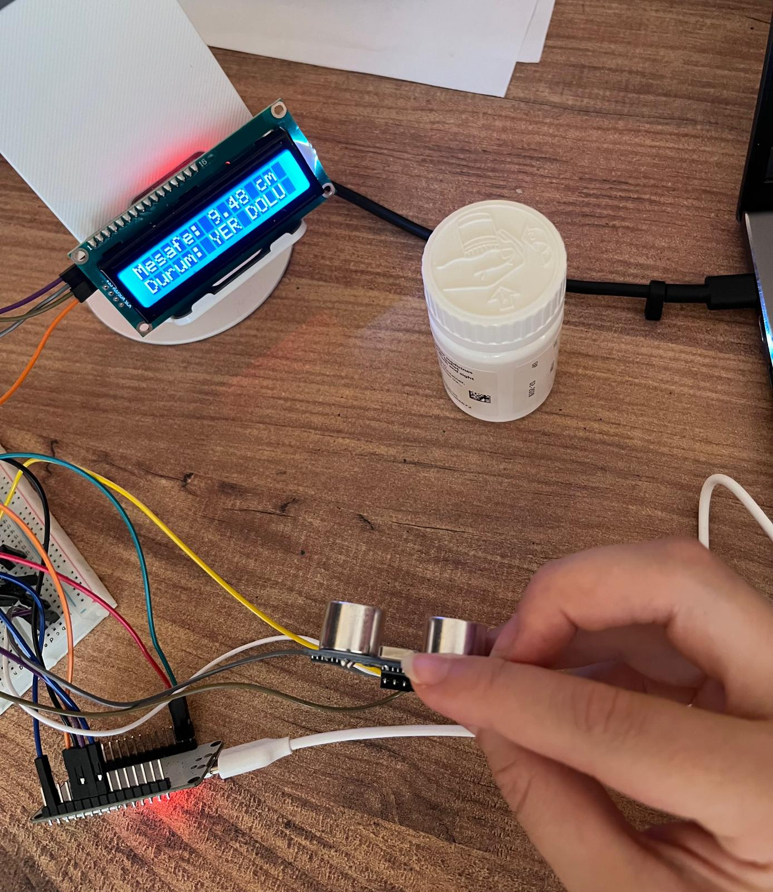
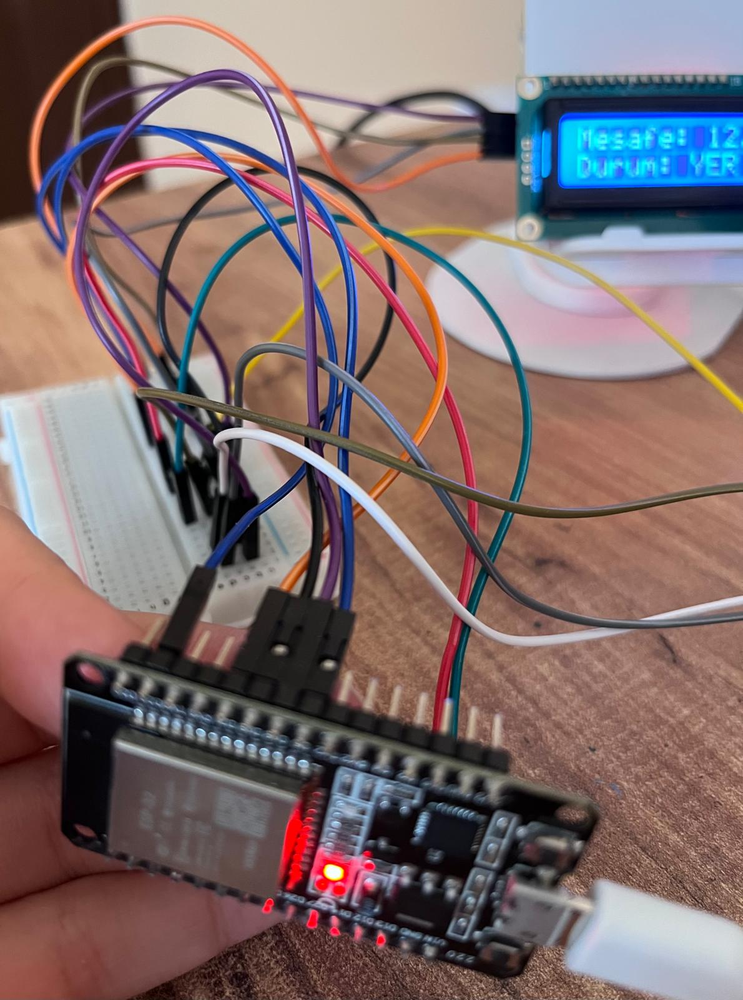
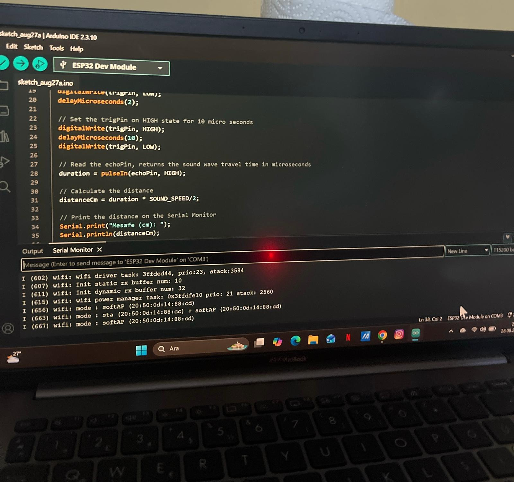

# 🚗 Akıllı Otopark Doluluk Takip Sistemi (ESP32 + HC-SR04 + I2C LCD)

Bu proje, ESP32 mikrokontrolcüsü ve ultrasonik mesafe sensörü kullanılarak geliştirilmiş prototip bir **Akıllı Otopark Doluluk Takip Sistemi**dir. Sistem, park yerinin mesafesini anlık olarak ölçer ve LCD ekran üzerinden "Dolu" veya "Boş" bilgisini gösterir.

## 🛠️ Kullanılan Donanım Bileşenleri
* **ESP32 Geliştirme Kartı**
* **HC-SR04 Ultrasonik Mesafe Sensörü** (Park yeri doluluk tespiti için)
* **16x2 I2C LCD Ekran** (Mesafe ve durum bilgisi için)
* **Breadboard ve Jumper Kablolar**

---

## 📌 Pin Bağlantı Şeması

**HC-SR04 Mesafe Sensörü:**
* **VCC** -> 5V / VIN
* **GND** -> GND
* **Trig** -> GPIO 18
* **Echo*** -> GPIO 19

**16x2 I2C LCD Ekran:**
* **VCC** -> 5V
* **GND** -> GND
* **SDA** -> GPIO 21
* **SCL** -> GPIO 22

---

## 📦 Gereken Kütüphaneler
Arduino IDE üzerinden projeyi çalıştırmadan önce şu kütüphane kuruldu:
1. `LiquidCrystal_I2C`

---

## 💻 Kaynak Kod
Projenin güncel Arduino koduna `akilli_otopark.ino` dosyasından ulaşabilirsiniz.
